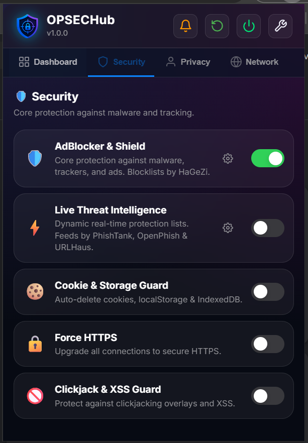
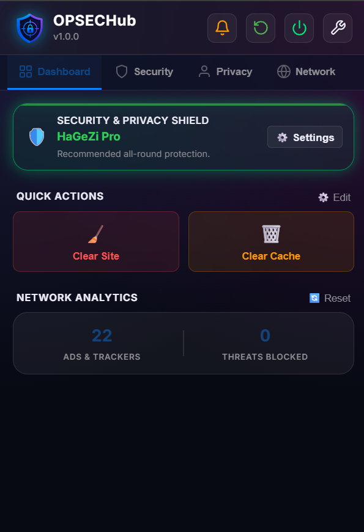
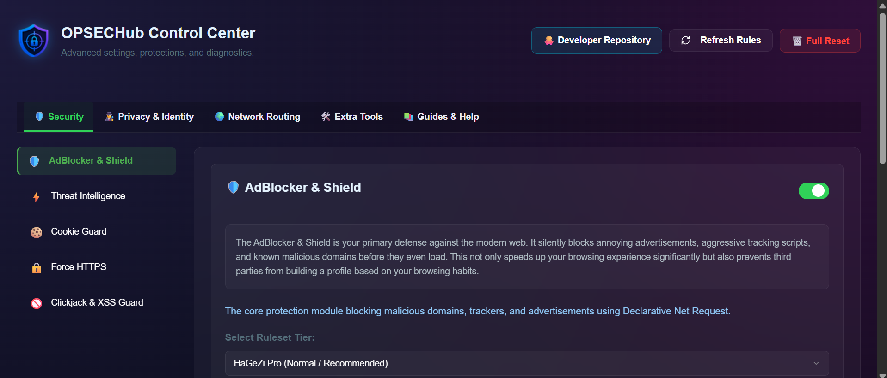
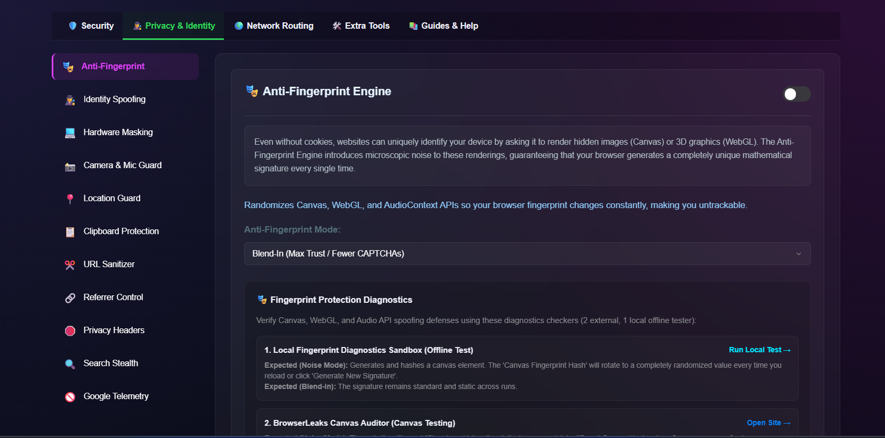
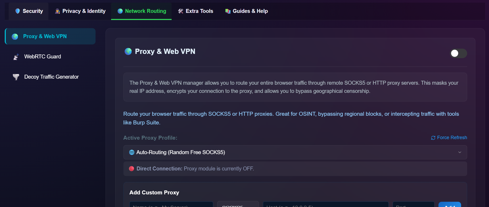
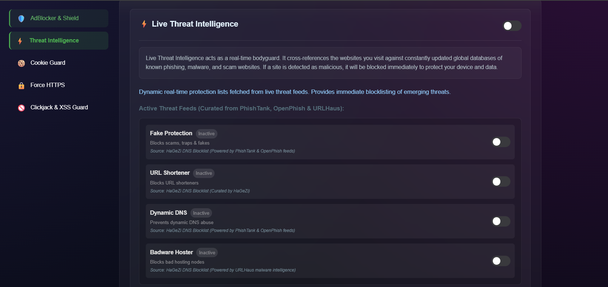
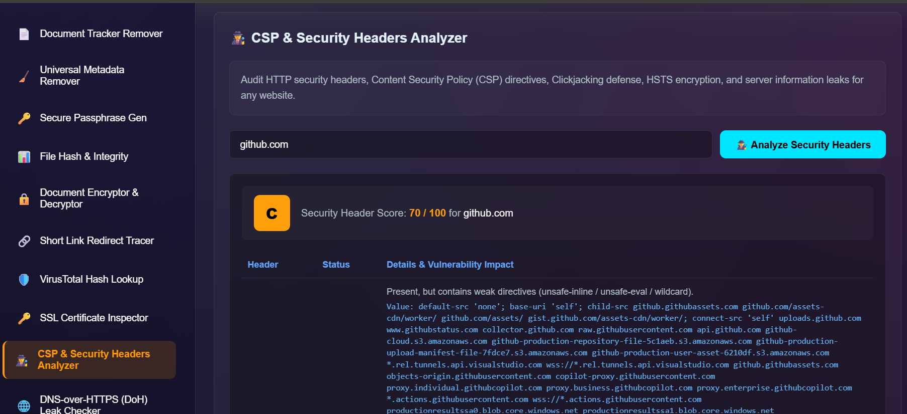
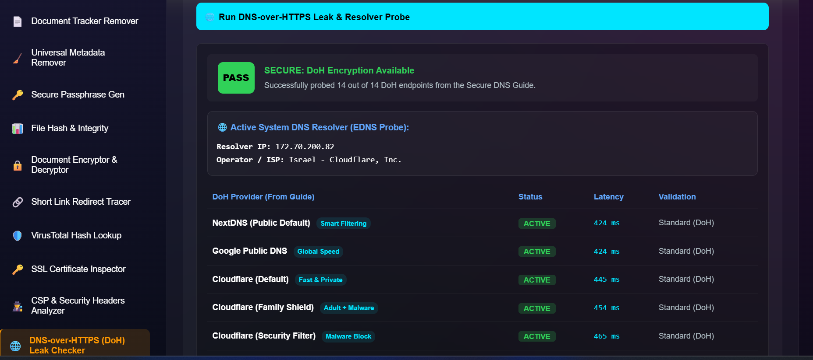

<div align="center">
  
  
  <h1>OPSECHub – OPSEC & Privacy Shield 🛡️</h1>
  
  <p><b>Advanced Browser-Based Privacy & Operational Security Suite v1.0.0</b></p>
  
  <p>
    A comprehensive browser extension designed for researchers, OSINT analysts, cybersecurity professionals, and privacy-conscious users.<br>
    Protects your digital footprint by blocking ads, trackers, phishing, telemetry, browser fingerprinting, and IP leaks in real-time.
  </p>

  <p>
    <a href="#-interface-preview">Interface Preview</a> •
    <a href="#-security">Security</a> •
    <a href="#-privacy--identity">Privacy</a> •
    <a href="#-network-routing">Network</a> •
    <a href="#-extra-tools">Extra Tools</a> •
    <a href="#-installation">Installation</a>
  </p>

  <p>
    <a href="https://github.com/tomsec8/OPSECHub/blob/main/LICENSE">
      
    </a>
    
  </p>
</div>

---

## 📸 Interface Preview

<details>
<summary><b>Click to expand screenshots</b></summary>
<br>

| **Main Popup Interface** | **Control Center Overview** | **AdBlocker & Security** |
|:---:|:---:|:---:|
|  |  |  |

| **Privacy & Identity** | **Network & Proxy** | **Live Threat Intelligence** |
|:---:|:---:|:---:|
|  |  |  |

| **Security Headers Analyzer** | **DoH Leak & Resolver Checker** |
|:---:|:---:|
|  |  |


</details>

---

## 🛡️ Security

* **DeclarativeNetRequest Core Shield & AdBlocker:**
  * **5 Tiered Rulesets:** HaGeZi Light (Basic), Multi (Enhanced), Pro (Recommended), Pro Plus (Strict), and Ultimate (Aggressive).
  * **Metadata Analytics:** Real-time compiled rule count and official release date metadata.
  * **Domain Allowlist:** Easy-to-manage exceptions list directly from the dashboard.
* **Live Threat Intelligence:** Dynamic blocklists fetched from global threat feeds (**PhishTank**, **OpenPhish**, **URLHaus**) stopping Fake Protection, URL Shorteners, Dynamic DNS abuse, and Badware Hosters.
* **Cookie & Storage Guard:** Automatically cleans up third-party tracking cookies, LocalStorage, and IndexedDB data on tab closure.
* **Force HTTPS:** Automatically intercepts and upgrades insecure HTTP connections to secure, encrypted HTTPS.
* **Clickjack & XSS Guard:** Prevents malicious framing and cross-site scripting attacks.

---

## 🕵️ Privacy & Identity

* **Anti-Fingerprint Engine:** Prevents unique browser canvas and WebGL fingerprinting (Blend-In vs Block modes).
* **Identity Spoofing:** Dynamic User-Agent switching (Windows Chrome, Mac Safari, Linux Firefox, iOS Safari, Android Chrome).
* **Hardware Masking:** Spoofs CPU concurrency cores, RAM memory stats, and GPU renderer strings to defeat hardware profiling.
* **Sensors & Clipboard:**
  * **Camera & Mic Guard:** Blocks unauthorized webcam and microphone enumeration.
  * **Location Guard:** Spoofs or blocks HTML5 Geolocation API requests.
  * **Clipboard Protection:** Shields system clipboard from silent reading or hijacking.
* **Web Navigation:**
  * **URL Sanitizer:** Cleans tracking query parameters (`utm_*`, `fbclid`, etc.) and strips hidden zero-width tracking characters.
  * **Referrer Control:** Enforces strict HTTP Referrer policies (`strict-origin-when-cross-origin` / `same-origin`).
  * **Privacy Headers:** Strips tracking headers (`Sec-CH-UA-Full-Version-List`, `X-Client-Data`).
* **Big Tech Telemetry:**
  * **Search Stealth:** Sanitizes search queries from tracking tokens across major engines.
  * **Google Telemetry Blocker:** Strips background tracking pings (`sendBeacon`, audit pings) sent to telemetry servers.

---

## 🌍 Network Routing

* **Proxy & Web VPN (Proxy Manager):** Built-in proxy manager supporting HTTP, HTTPS, and SOCKS5 proxies with a single-click toggle.
* **WebRTC Guard:** Enforces strict WebRTC routing policies to prevent local and public IP leaks via STUN/TURN queries.
* **Decoy Traffic Generator:** Automatically generates background decoy traffic to obfuscate your real browsing patterns from ISP and local network eavesdroppers.

---

## 🛠️ Extra Tools

* **📄 Document Tracker Remover:** Scans and removes tracking pixels, phone-home URLs, metadata leaks, and macros from PDFs and Office documents.
* **🧹 Universal Metadata Remover:** Cleans hidden EXIF metadata from files and images.
* **🔑 Secure Passphrase Gen:** Generates high-entropy, memorable secure passphrases.
* **📊 File Hash & Integrity:** Calculates exact SHA-256 / MD5 checksums for file integrity verification.
* **🔒 Document Encryptor & Decryptor:** Encrypt sensitive text or documents with secure algorithms.
* **🔗 Short Link Redirect Tracer:** Safely traces and analyzes shortened URLs without executing their payloads.
* **🛡️ VirusTotal Hash Lookup:** Quickly look up file hashes in the VirusTotal database.
* **🔑 SSL Certificate Inspector:** View deep details about target server SSL/TLS certificates.
* **🕵️ CSP & Security Headers Analyzer:** Evaluates HTTP Security Headers (CSP, HSTS, X-Frame-Options) and assigns a security score (A+ to F).
* **🌐 DNS-over-HTTPS (DoH) Leak Checker:** Probes 14 top Secure DNS providers and measures real-time latency (ms).

---

## 🔑 Permissions & Transparency

OPSECHub is built on a zero-telemetry, privacy-first architecture. Because OPSECHub functions as an all-in-one OPSEC shield, Chrome requires specific Manifest V3 permissions. Below is the complete breakdown of why every permission in `manifest.json` is required:

| Permission | Type | Purpose / Justification |
| :--- | :--- | :--- |
| `declarativeNetRequest` | Required | Powers the high-performance AdBlocker shield for domain & tracker blocking. |
| `declarativeNetRequestWithHostAccess` | Required | Enables ruleset application across external domains. |
| `declarativeNetRequestFeedback` | Required | Provides compiled rules statistics and blocked count feedback. |
| `webRequest` | Required | Intercepts background tracking pings, Google telemetry (`sendBeacon`), and audit pings. |
| `proxy` | Required | Enables the built-in Proxy Manager to route browser traffic through HTTP/SOCKS5 proxies. |
| `privacy` | Required | Enforces strict WebRTC routing policies to prevent IP leaks and manages Referrer control. |
| `cookies` & `browsingData` | Required | Allows Cookie Guard to auto-clean tracking cookies & LocalStorage when tabs close. |
| `scripting` & `activeTab` | Required | Injects Anti-Fingerprint noise scripts (Canvas/WebGL) and Security Header Analyzers. |
| `tabs` & `webNavigation` | Required | Monitors navigation events to apply URL Sanitizer rules and check domain allowlists. |
| `contentSettings` | Required | Manages site-level permissions for Camera, Microphone, and HTML5 Geolocation protection. |
| `clipboardWrite` | Required | Allows one-click copying of generated passphrases, hashes, and sanitized URLs. |
| `storage` & `alarms` | Required | Persists user module preferences locally and triggers background decoy traffic schedules. |
| `downloads` | Optional | Used for exporting diagnostic reports, sanitized files, and metadata analysis. |
| `<all_urls>` | Host Access | Required to enforce global threat intelligence blocking across all browsed domains. |

> **🔒 Privacy Assurance:** OPSECHub does **NOT** collect, log, track, or exfiltrate any user data, search queries, or browsing history. All operations occur strictly on your local machine.

---

## 📚 Guides & Help

* **Secure DNS Setup Guide:** Interactive step-by-step setup guide for configuring encrypted DNS (DoH/DoT) across all major platforms: Chrome, Firefox, Edge, Windows, macOS, Android, and iOS.

---

## 📥 Installation

### Developer Mode (Unpacked Extension)
1. Download the latest `Source code (zip)` from the [Releases Page](https://github.com/tomsec8/OPSECHub/releases) and extract it, or clone this repository:
   ```bash
   git clone https://github.com/tomsec8/OPSECHub.git
   ```
2. **Important:** Generate the initial AdBlocker rulesets by running the updater utility:
   ```bash
   python tools/updater.py
   ```
   *(This downloads and converts the latest blocklists into Chrome MV3 format).*
3. Open Google Chrome and navigate to `chrome://extensions`.
4. Enable **Developer mode** in the top right corner.
5. Click **Load unpacked** and select the `OPSECHub/` folder.
6. Pin **OPSECHub** to your toolbar for instant access!

### 🔄 Ruleset Updater Utility
OPSECHub includes an external Python utility to keep static DNR rulesets synchronized with upstream blocklist releases.
```bash
python tools/updater.py
```
This utility converts raw blocklist rules into Manifest V3 rules and updates the metadata timestamps.

## 🏆 Credits & Attributions

* **AdBlocker & Shield Rules:** Powered by [HaGeZi DNS Blocklists](https://github.com/hagezi/dns-blocklists)
* **Live Threat Feeds:** Curated from [PhishTank](https://phishtank.org/), [OpenPhish](https://openphish.com/), and [URLHaus](https://urlhaus.abuse.ch/).
* **Proxy Manager Lists:** Public open proxies indexed and aggregated from [Free-Proxy-List.net](https://free-proxy-list.net/) & ProxyScrape APIs.
* **Secure DNS Providers:** Benchmark integrations for Cloudflare, Quad9, AdGuard DNS, Control D, Mullvad, NextDNS, CleanBrowsing, Google Public DNS, and DNS.SB.

### 📦 Third-Party Libraries
* [**pdf-lib**](https://github.com/Hopding/pdf-lib) (PDF parsing & modification)
* [**JSZip**](https://github.com/Stuk/jszip) (Office document tracking removal)
* [**ExifReader**](https://github.com/mattiasw/ExifReader) (Image metadata parsing)
* [**spark-md5**](https://github.com/satazor/js-spark-md5) (Fast MD5 checksums for File Hash Integrity)

---

## 📄 License

This project is licensed under the **GNU General Public License v3.0**. See the [LICENSE](LICENSE) file for details.

<br>
<p align="center">
  Developed with ❤️ by <b>TomSec8</b> for the Cybersecurity & OSINT Community.
</p>
