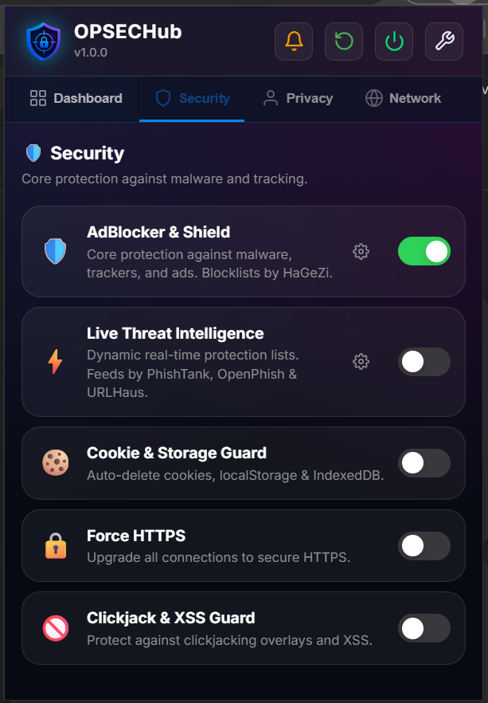
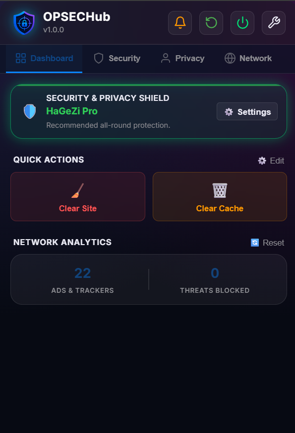
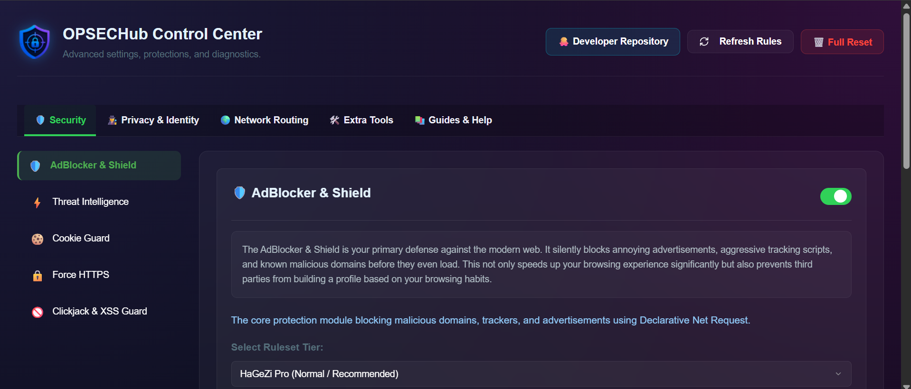
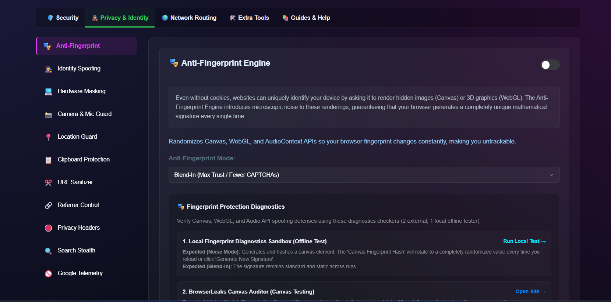
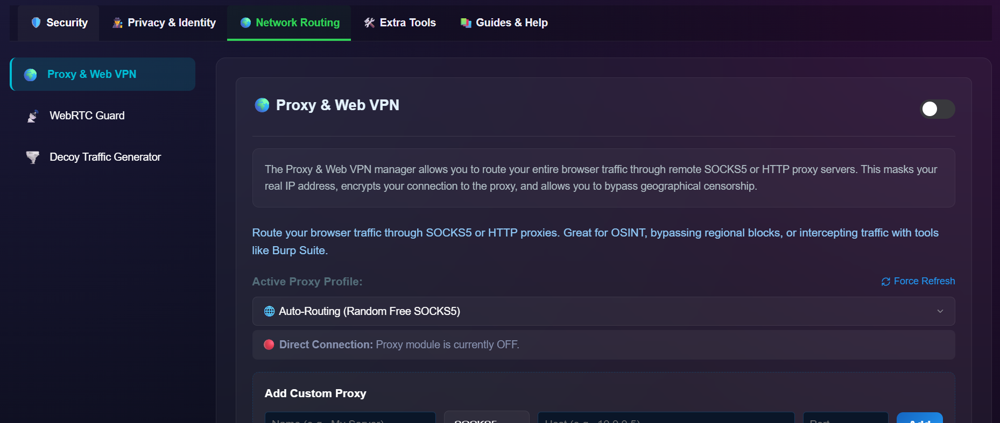
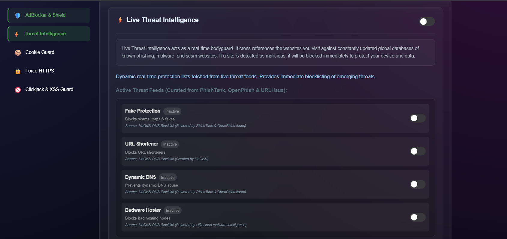
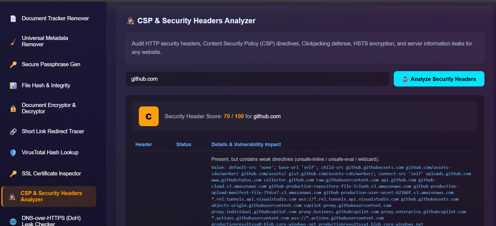
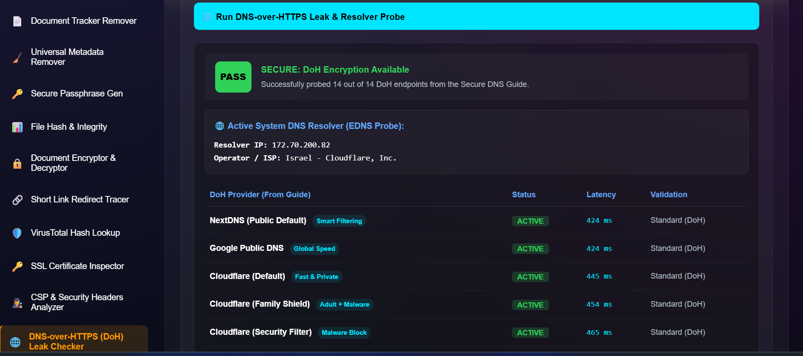

<div align="center">
  

  <h1>OPSECHub – OPSEC & Privacy Shield 🛡️</h1>

  <p><b>Advanced Browser-Based Privacy & Operational Security Suite v1.1.0</b></p>

  <p>
    A comprehensive browser extension designed for researchers, OSINT analysts, cybersecurity professionals, and privacy-conscious users.<br>
    Protects your digital footprint by blocking ads, trackers, phishing, telemetry, browser fingerprinting, and IP leaks in real-time.
  </p>

  <p>
    <a href="#-whats-new-in-110">What's New</a> •
    <a href="#-interface-preview">Interface Preview</a> •
    <a href="#-security">Security</a> •
    <a href="#-privacy--identity">Privacy</a> •
    <a href="#-network-routing">Network</a> •
    <a href="#-extra-tools">Extra Tools</a> •
    <a href="#-installation">Installation</a>
  </p>

  <p>
    <a href="https://github.com/tomsec8/OPSECHub/blob/main/LICENSE">
      
    </a>
    
    
  </p>
</div>

<p align="center">
  <br><br>
  <a href="https://chromewebstore.google.com/detail/opsechub/gkhbmoafodmekcdpkcgpekfkhffjbijl">
    <picture>
      <source srcset="https://i.imgur.com/XBIE9pk.png" media="(prefers-color-scheme: dark)">
      
    </picture>
  </a>
</p>

## ✨ What's New in 1.1.0

* **Remote filter lists (Git/CDN):** Network blocking is driven by dynamic Declarative Net Request rules fetched from [`tomsec8/OPSECHub-Lists`](https://github.com/tomsec8/OPSECHub-Lists) (jsDelivr + GitHub raw fallbacks). No static `rule_resources` pack is required for day-to-day updates.
* **First-run setup:** On install, a welcome flow lets you pick **Recommended**, **Minimal**, or **No lists**. Skipping leaves AdBlocker off until you enable lists in Settings.
* **Instant AdBlocker pause:** Turning AdBlocker off keeps installed rules cached and stops blocking immediately via a high-priority allow gate (same idea as other modern blockers). Turning it back on resumes instantly when rules are already present.
* **Master power switch:** The popup power button mutes the whole suite (network gate + enabled modules) without wiping your saved preferences.
* **Popup UX:** Dashboard hosts AdBlocker on/off + per-site exclusion; Security links to list management in Settings. Header refresh runs the same remote-list sync as the Options page (with progress when downloads are needed).
* **Optional permissions:** Sensitive APIs (`privacy`, `browsingData`, `contentSettings`, `webRequest`) are requested only when you enable the tools that need them.
* **Crash-safe list apply:** If the browser closes mid-download, incomplete installs resume on the next wake.

---

## 📸 Interface Preview

<details>
<summary><b>Click to expand screenshots</b></summary>
<br>

| **Main Popup Interface** | **Control Center Overview** | **AdBlocker & Security** |
|:---:|:---:|:---:|
|  |  |  |

| **Privacy & Identity** | **Network & Proxy** | **Live Threat Intelligence** |
|:---:|:---:|:---:|
|  |  |  |

| **Security Headers Analyzer** | **DoH Leak & Resolver Checker** |
|:---:|:---:|
|  |  |

</details>

---

## 🛡️ Security

* **AdBlocker & Shield (remote dynamic DNR):**
  * Choose curated lists (EasyList, EasyPrivacy, uBlock filters, AdGuard/uBO, Peter Lowe, badware, malicious URL feeds, and more) from Settings.
  * Lists download from Git/CDN, install as dynamic DNR rules, and refresh on a schedule (or manually via Refresh).
  * Bundled `rules/regex/` and cosmetic assets ship as offline fallback; live regex/cosmetics prefer the remote cache when available.
  * **Per-site exclusion** from the popup Dashboard (“Block ads on …”).
* **Live Threat Feeds:** Optional domain feeds (fake shops, shorteners, dynDNS, badware) managed alongside filter lists.
* **Cookie & Storage Guard:** When the last tab for an origin closes, clears that origin’s cookies / site data (optional `browsingData` permission).
* **Force HTTPS:** Upgrades `http://` navigations to HTTPS (skips localhost / `.onion` / `.i2p`).
* **WebRTC Guard:** Strict WebRTC IP-handling policy to reduce local/public IP leaks.

---

## 🕵️ Privacy & Identity

* **Camera & Mic Guard:** Blocks unauthorized webcam and microphone access / enumeration.
* **Location Guard:** Spoofs or blocks HTML5 Geolocation API requests.
* **Clipboard Protection:** Shields the clipboard from silent reading / hijacking.
* **Privacy Headers (DNT & GPC):** Sends `DNT: 1` / `Sec-GPC` and exposes matching `navigator` signals to pages.
* **Google Telemetry Blocker:** Strips Chrome client / consistency headers such as `X-Client-Data` from requests.

---

## 🌍 Network Routing

* **Proxy Manager:** HTTP / HTTPS / SOCKS5 profiles with a quick toggle (Chrome requires `proxy` as a required permission).
* **Burp Suite preset:** Optional local intercept profile (`127.0.0.1:8080`) for lab use.

---

## 🛠️ Extra Tools

* **📄 Document Tracker Remover:** Strips tracking pixels / phone-home URLs from PDFs and Office docs.
* **🧹 Universal Metadata Remover:** Cleans hidden EXIF metadata from files and images.
* **🔑 Secure Passphrase Gen:** High-entropy memorable passphrases.
* **📊 File Hash & Integrity:** SHA-256 / MD5 checksums.
* **🔒 Document Encryptor & Decryptor:** Encrypt sensitive text or documents.
* **🔗 Short Link Redirect Tracer:** Trace shorteners safely.
* **🛡️ VirusTotal Hash Lookup:** Opens VirusTotal for a local hash (no API key stored).
* **🔑 SSL Certificate Inspector:** Inspect target TLS certificate details.
* **🕵️ CSP & Security Headers Analyzer:** Audits a site’s security headers (CSP, HSTS, X-Frame-Options / clickjacking, etc.) and scores them (A+ → F).
* **🌐 DNS-over-HTTPS (DoH) Leak Checker:** Probes major Secure DNS providers and latency.

---

## 🔑 Permissions & Transparency

OPSECHub is built on a zero-telemetry, privacy-first architecture. Manifest V3 permissions are split between **always required** and **optional** (granted when you enable the matching tool).

| Permission | Type | Purpose |
| :--- | :--- | :--- |
| `storage` / `unlimitedStorage` | Required | Preferences, list selection, remote list cache. |
| `tabs` / `scripting` | Required | Popup/site context, cosmetics & module injection. |
| `declarativeNetRequest` (+ host access / feedback) | Required | AdBlocker / threat blocking and block counters. |
| `alarms` | Required | Periodic remote catalog / list refresh. |
| `proxy` | Required | Proxy Manager (Chrome does not allow this as optional). |
| `privacy` | Optional | WebRTC / privacy policy controls. |
| `browsingData` | Optional | Cookie / site-data cleanup tools. |
| `contentSettings` | Optional | Camera, mic, geolocation site controls. |
| `webRequest` | Optional | Modules that need request observation. |
| `<all_urls>` | Host Access | Apply protection across browsed sites. |

> **🔒 Privacy Assurance:** OPSECHub does **NOT** collect, log, track, or exfiltrate browsing history or search queries. Filter catalogs and list bodies are fetched from your configured Git/CDN sources; runtime state stays in Chrome’s extension storage on your machine.

**Network endpoints used by design (document for users):**
* Filter lists catalog/CDN: [`OPSECHub-Lists`](https://github.com/tomsec8/OPSECHub-Lists) via jsDelivr / GitHub raw
* Optional free-proxy indexes and public IP / DoH check helpers used by Extra Tools / Proxy UI

---

## 📚 Guides & Help

* **Secure DNS Setup Guide:** Interactive DoH/DoT setup help across major browsers and OSes (in Options → Tools / Guides).

---

## 📥 Installation

### Developer Mode (Unpacked Extension)

1. Clone this repository (or download the latest release source):
   ```bash
   git clone https://github.com/tomsec8/OPSECHub.git
   ```
2. Open Google Chrome → `chrome://extensions`.
3. Enable **Developer mode**.
4. Click **Load unpacked** and select the **`OPSECHub1.1.0/`** folder (the folder that contains `manifest.json`).
5. Complete the **welcome setup** (recommended lists, minimal, or skip).
6. Pin **OPSECHub** to the toolbar.

> **Note:** Day-to-day list updates come from Git/CDN after install. You do **not** need to run a local Python rules builder just to use the extension.

### Where data lives

* Extension **code** = the `OPSECHub1.1.0/` folder on disk.
* **Selected lists, caches, and settings** = Chrome extension storage (browser profile), not files written into the extension folder.

---

## 🏆 Credits & Attributions

* **Remote list pipeline:** [`tomsec8/OPSECHub-Lists`](https://github.com/tomsec8/OPSECHub-Lists)
* **Filter list authors:** [EasyList](https://easylist.to/), [EasyPrivacy](https://easylist.to/), [uBlock Origin filters](https://github.com/uBlockOrigin/uAssets), [AdGuard](https://adguard.com/), [Peter Lowe’s list](https://pgl.yoyo.org/adservers/), [HaGeZi](https://github.com/hagezi/dns-blocklists), and other upstream maintainers bundled or mirrored in the catalog
* **Threat / badware signals:** Community feeds mirrored through the list publisher (see catalog metadata)
* **Proxy Manager lists:** Public open-proxy aggregators (e.g. proxifly / free-proxy indexes)
* **Secure DNS Providers:** Cloudflare, Quad9, AdGuard DNS, Control D, Mullvad, NextDNS, CleanBrowsing, Google Public DNS, DNS.SB, and others used by the DoH checker

### 📦 Third-Party Libraries

* [**pdf-lib**](https://github.com/Hopding/pdf-lib) — PDF parsing & modification  
* [**JSZip**](https://github.com/Stuk/jszip) — Office document tracking removal  
* [**ExifReader**](https://github.com/mattiasw/ExifReader) — Image metadata parsing  
* [**spark-md5**](https://github.com/satazor/js-spark-md5) — Fast MD5 checksums  

---

## 📄 License

This project is licensed under the **GNU General Public License v3.0**. See the [LICENSE](LICENSE) file for details.

<br>
<p align="center">
  Developed with ❤️ by <b>TomSec8</b> for the Cybersecurity & OSINT Community.
</p>
